# Cloud Computing Assignment - 21/07/2020

## Group
1. Alvyn Abranches
2. Omkar Kadam
3. Dharamveer Rana

## Work
1. Sign up and Login into Amazon Services
    -   
    -  
    - 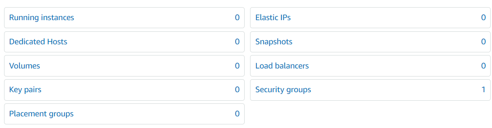 
    - 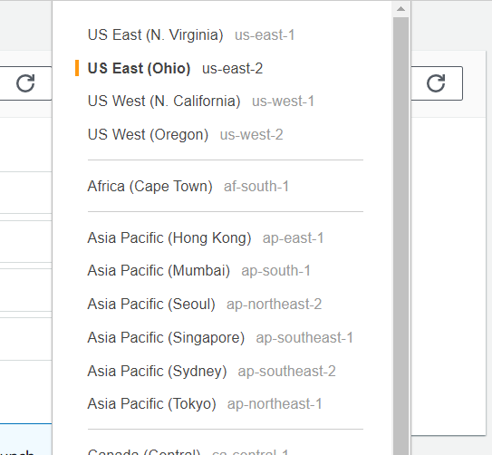 
    - 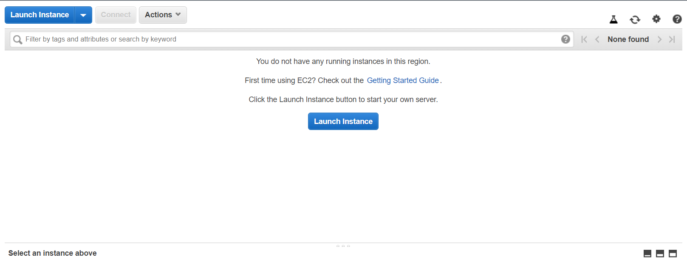 
    - 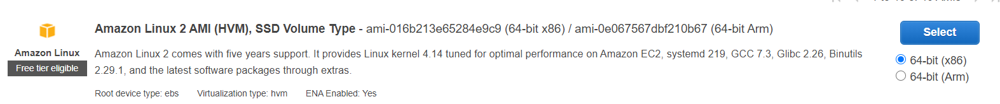 
    -  
    -  
    -  
    - 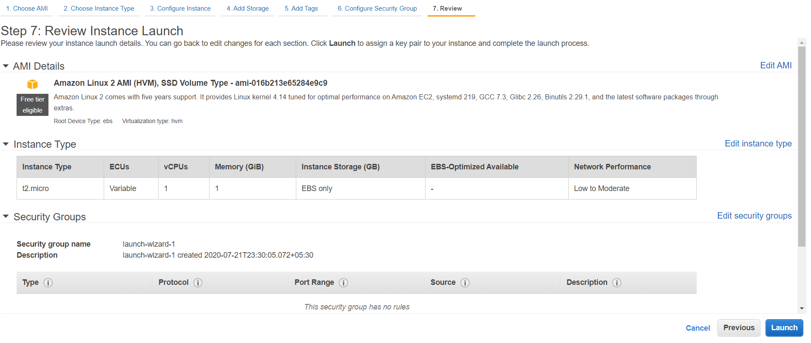 
    - 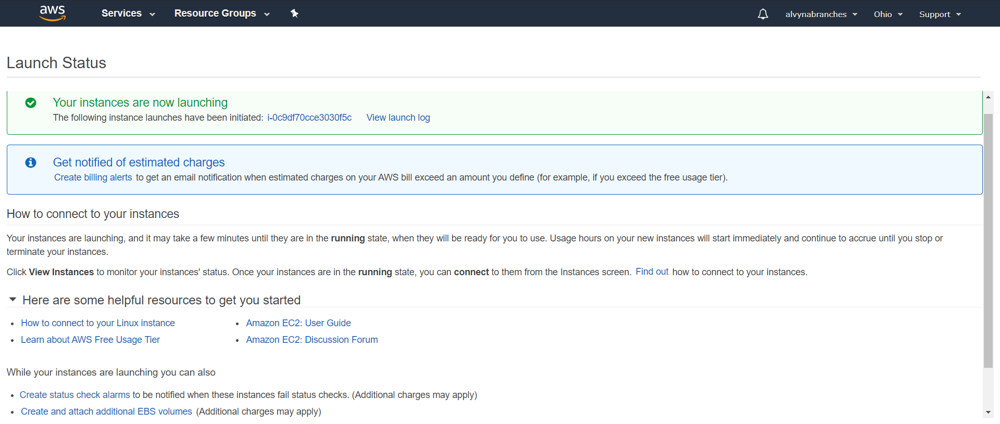 
    - 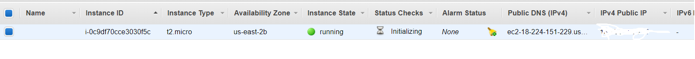 
    - 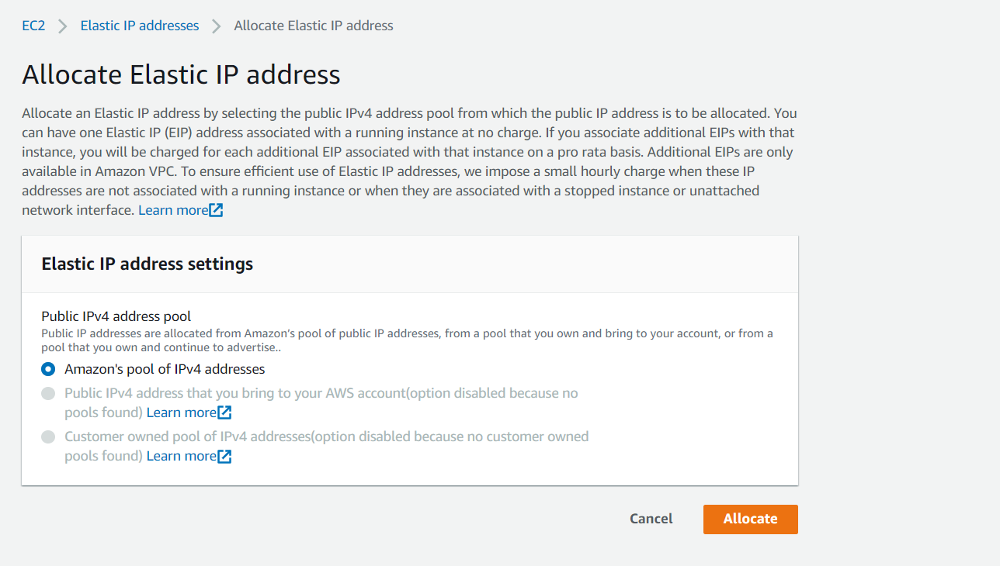 
    - 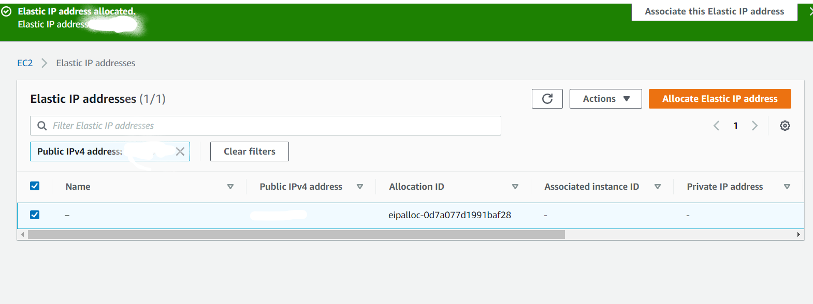 
    - 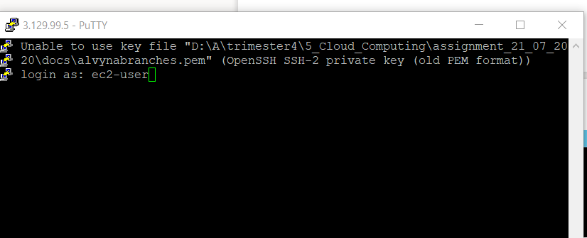 
    - 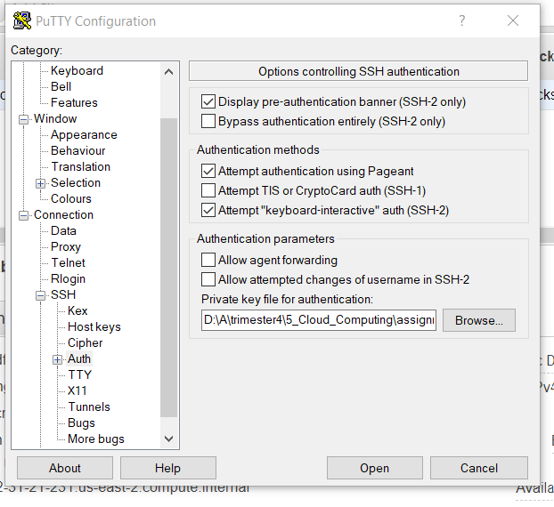 
    - 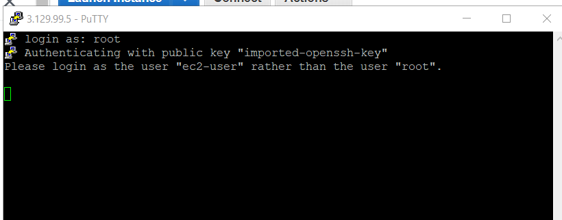 
    - 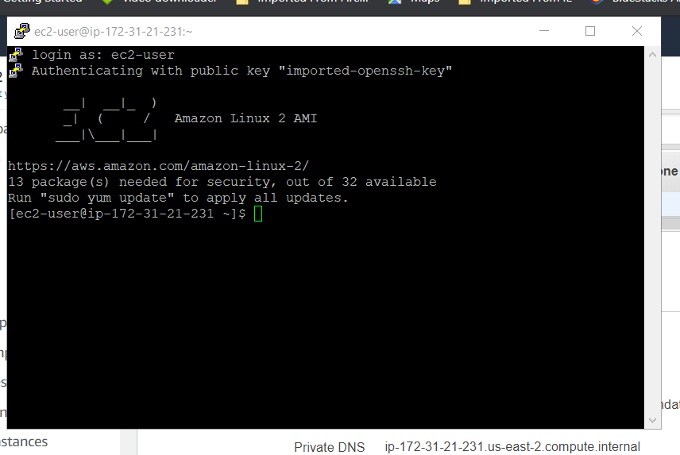 
    - 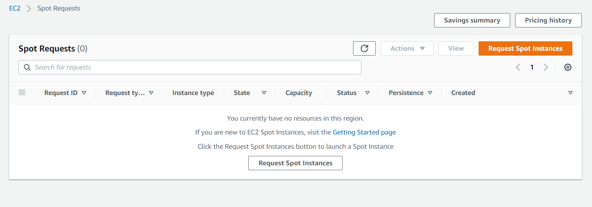 
    - 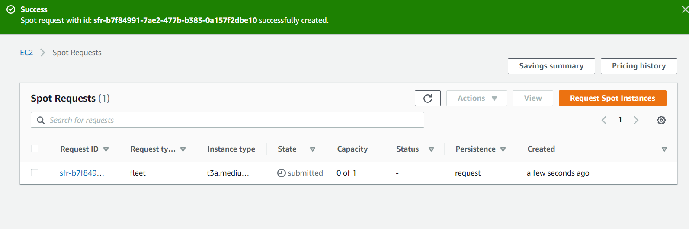 
    - 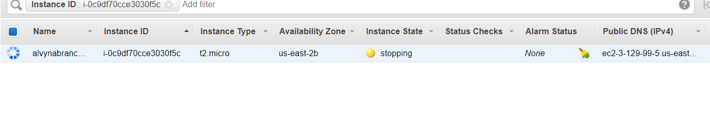 
    - 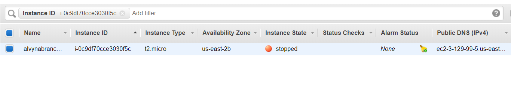 