# Assignment of 20/07/2020
1. 5 + 5 
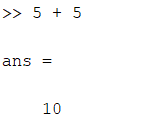
2. 3 ^ 2 
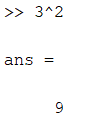
3. sin(pi / 2) 
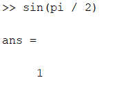
4. 7 / 0 
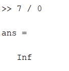
5. 732 * 20.3 
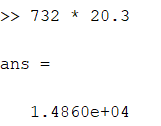
6. x = 3 
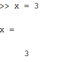
7. y = x + 5 
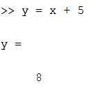
8. x = 9 

9. sqrt(78); 
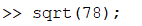
10. 9878 / ans 
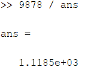
11. a = 2; b = 7; c = a * b 

12. who 
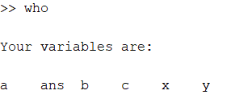
13. whos 
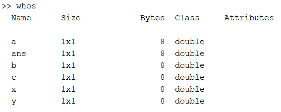
14. clear x 
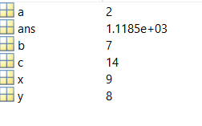 
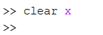 
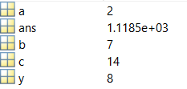
15. clear 
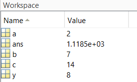 
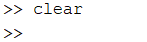 
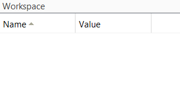
   
[Matlab Onramp Certificate](https://matlabacademy.mathworks.com/progress/share/certificate.html?id=4cc77241-72c8-4b15-8469-ef01ed56c083) 
[Matlab Onramp Progress](https://matlabacademy.mathworks.com/progress/share/report.html?id=4cc77241-72c8-4b15-8469-ef01ed56c083) 
[Machine Learning Onramp Certificate](https://matlabacademy.mathworks.com/progress/share/certificate.html?id=68be0d79-f0aa-4be3-956d-3821702a4449) 
[Machine Learning Onramp Progress](https://matlabacademy.mathworks.com/progress/share/report.html?id=68be0d79-f0aa-4be3-956d-3821702a4449) 
[Deep Learning Onramp Certificate](https://matlabacademy.mathworks.com/progress/share/certificate.html?id=611cb0c1-cc31-4b20-86f1-02688ace03d5) 
[Deep Learning Onramp Progress](https://matlabacademy.mathworks.com/progress/share/report.html?id=611cb0c1-cc31-4b20-86f1-02688ace03d5) 